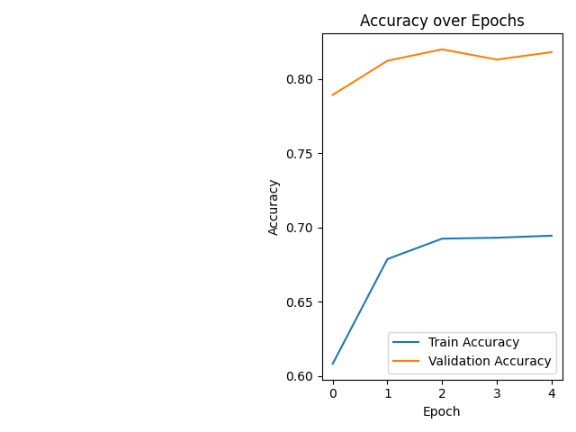

# CIFAR-10 Image Classification with MobileNetV2 - Documentation

This document provides a detailed explanation of the project, including the training process, inference script, and results.

## 1. Project Overview

This project implements an image classification model to classify images from the CIFAR-10 dataset. The model is built using transfer learning from a pre-trained MobileNetV2 model.

The project includes:
- A Jupyter Notebook (`train.ipynb`) to train the model.
- A Python script (`inference.py`) to perform inference on new images.
- The trained model saved as `cifar10_mobilenetv2.keras`.

## 2. Training the Model

The model is trained in the `train.ipynb` notebook. The notebook is structured as follows:

### 2.1. Training Code

The following code is extracted from the `train.ipynb` notebook.

```python
import tensorflow as tf
import matplotlib.pyplot as plt
import numpy as np
import os

# 1. Hyperparameters
batch_size = 64
epochs = 5
input_shape = (32, 32, 3)
# MobileNetV2 prefers larger inputs, so we will resize inside the model
resized_shape = (96, 96, 3)

# 2. Load and Prepare Data
print("Downloading and preparing CIFAR-10 data...")
(x_train, y_train), (x_test, y_test) = tf.keras.datasets.cifar10.load_data()

class_names = ['airplane', 'automobile', 'bird', 'cat', 'deer',
               'dog', 'frog', 'horse', 'ship', 'truck']

# 3. Data Augmentation Pipeline
# Building this into the model ensures it only runs during training (on the GPU if available)
data_augmentation = tf.keras.Sequential([
    tf.keras.layers.RandomFlip("horizontal"),
    tf.keras.layers.RandomRotation(0.1),
    tf.keras.layers.RandomZoom(0.1),
], name="data_augmentation")

# 4. Load Pretrained Model (Transfer Learning)
print("Loading pretrained MobileNetV2...")
base_model = tf.keras.applications.MobileNetV2(
    input_shape=resized_shape,
    include_top=False,
    weights='imagenet'
)

# Freeze the base model to only train the new classification head
base_model.trainable = False

# 5. Build the Final Model
inputs = tf.keras.Input(shape=input_shape)
# Apply augmentation
x = data_augmentation(inputs)
# Resize to fit MobileNetV2's minimum optimal size
x = tf.keras.layers.Resizing(96, 96)(x)
# MobileNetV2 specific preprocessing (scales pixels between -1 and 1)
x = tf.keras.applications.mobilenet_v2.preprocess_input(x)
# Pass through base model
x = base_model(x, training=False)
# Convert features to a single vector per image
x = tf.keras.layers.GlobalAveragePooling2D()(x)
# Add dropout for regularization
x = tf.keras.layers.Dropout(0.2)(x)
# Final output layer
outputs = tf.keras.layers.Dense(10, activation='softmax')(x)

model = tf.keras.Model(inputs, outputs)

# 6. Compile and Train
model.compile(optimizer=tf.keras.optimizers.Adam(learning_rate=0.001),
              loss='sparse_categorical_crossentropy',
              metrics=['accuracy'])

print("Starting training...")
history = model.fit(
    x_train, y_train,
    epochs=epochs,
    validation_data=(x_test, y_test),
    batch_size=batch_size
)

# 7. Evaluate Metrics
print("
Evaluating on test data...")
test_loss, test_acc = model.evaluate(x_test, y_test, verbose=2)
print(f"Final Test Accuracy: {test_acc*100:.2f}%")

# 8. Save the Model
save_path = 'cifar10_mobilenetv2.keras'
model.save(save_path)
print(f"Model saved to {save_path}")

# 9. Plotting Training Curves
plt.figure(figsize=(12, 5))

# Loss plot
plt.subplot(1, 2, 1)
plt.plot(history.history['loss'], label='Train Loss')
plt.plot(history.history['val_loss'], label='Validation Loss')
plt.title('Loss over Epochs')
plt.xlabel('Epoch')
plt.ylabel('Loss')
plt.legend()

# Accuracy plot
plt.subplot(1, 2, 2)
plt.plot(history.history['accuracy'], label='Train Accuracy')
plt.plot(history.history['val_accuracy'], label='Validation Accuracy')
plt.title('Accuracy over Epochs')
plt.xlabel('Epoch')
plt.ylabel('Accuracy')
plt.legend()

plt.tight_layout()
plt.savefig('training_curves.png')
print("Training curves saved to 'training_curves.png'.")
plt.show()

```

### 2.2. Training Results

The training and validation accuracy and loss are plotted and saved as `training_curves.png`.



## 3. Inference

The `inference.py` script is used to predict the class of a single image using the trained model.

### 3.1. Inference Code

```python
import tensorflow as tf
import numpy as np
from PIL import Image

# Define CIFAR-10 classes
class_names = ['airplane', 'automobile', 'bird', 'cat', 'deer', 
               'dog', 'frog', 'horse', 'ship', 'truck']

def predict_image(image_path, model_path='cifar10_mobilenetv2.keras'):
    """Loads a saved model and predicts the class of an image."""
    
    # 1. Load the saved model
    try:
        model = tf.keras.models.load_model(model_path)
    except Exception as e:
        print(f"Error loading model. Did you run the training script? Details: {e}")
        return

    # 2. Load and preprocess the image
    try:
        # Load image and resize to standard CIFAR-10 dimensions (32x32)
        # Note: The model handles the internal resizing to 96x96 and preprocessing
        img = Image.open(image_path).convert('RGB')
        img = img.resize((32, 32))
        
        # Convert to numpy array and add batch dimension: shape becomes (1, 32, 32, 3)
        img_array = np.array(img)
        img_array = np.expand_dims(img_array, axis=0)
        
    except Exception as e:
        print(f"Error processing image {image_path}: {e}")
        return

    # 3. Make the prediction
    predictions = model.predict(img_array, verbose=0)
    
    # 4. Interpret the results
    predicted_idx = np.argmax(predictions[0])
    confidence = predictions[0][predicted_idx]
    predicted_class = class_names[predicted_idx]
    
    print(f"Image: {image_path}")
    print(f"Predicted Class: {predicted_class}")
    print(f"Confidence: {confidence * 100:.2f}%")

if __name__ == "__main__":
    # Note: Replace 'sample_image.jpg' with an actual path to an image on your machine
    test_image = "OIP.jpg" 
    
    import os
    if os.path.exists(test_image):
        predict_image(test_image)
    else:
        print(f"Please provide a valid image path to test. '{test_image}' not found.")
```

### 3.2. Example Inference

Here is an example of running the inference script on the `OIP.jpg` image.


**Command:**
```bash
python inference.py --image_path OIP.jpg
```

**Expected Output:**
```
Image: OIP.jpg
Predicted Class: <Predicted-Class>
Confidence: <Confidence-Score>%
```
*(The predicted class and confidence will vary depending on the model's training.)*
